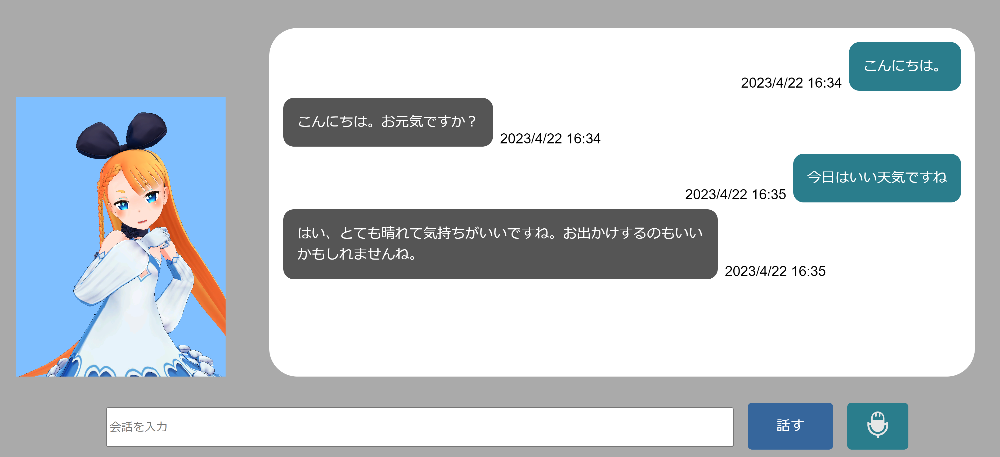

# AIChat

二次元キャラクターとチャットを楽しむためのアプリです。  
下のテキストボックスに会話を入力、もしくはマイク入力で会話が出来ます。




## 使い方

### アプリの初期設定・起動

`git clone`でこのリポジトリごとクローンしたら、ターミナルで以下のコマンドを実行します。

```bash
$ cd ./AIChat
$ docker-compose up -d
```

初回起動時のみ、追加で以下の作業が必要になります。

---

まず、下記コマンドを実行します。
```bash
docker run --rm -v $PWD:/code aichat python secret_regene.py
```

実行して表示された`SECRET_KEY = ・・・`をAIChat/settings.pyに書き込んでください。

---

ここまでの操作ができていれば、作業は完了です。

https://127.0.0.1:8000 にアクセスして、アプリを使用してください。 

### モデル・モーションの変更
描画されるモデルは、以下のフォルダに格納されています。  

```cmd
- AIChat
    - static
        - vrm
            - AliciaSolid.vrm   //キャラクターのモデルデータ
        - fbx
            - Idle.fbx          //待機中のモーション
            - Thinking.fbx      //会話中のモーション
        
```
モデルの場合、拡張子が`.vrm`であるファイルを入手し、`AliciaSolid.vrm`と同じフォルダに格納してください。  
モーションは、[mixamo](https://www.mixamo.com/)で提供されている`.fbx`であれば動きます。  


その後、`AIChat\static\js\avatar.js`の43～45行目を修正します。

```JavaScript
this.modelUrl = './static/vrm/AliciaSolid.vrm';   //モデルのバス
this.animationUrl = './static/fbx/Idle.fbx';      //待機中のモーションのパス
this.animationUrl2 = './static/fbx/Thinking.fbx'; //会話中のモーションのパス
```

### ChatGPT API連携
ChatGPT APIと連携することで、キャラクターとの会話が楽しめます。  
`openai.api_key`に[openai](https://platform.openai.com/)で取得したAPI KEYを入力してください。

ChatGPT以外の動作を確認したい場合は、`AIChat\chat_app\views.py`の18行目から27行目をコメントアウトすれば、会話をオウム返ししてくれます。

```python
def post(self, request, *args, **kwargs):
    input_text = request.POST.get('input_text')

    if input_text == 'undefined':
        input_text = 'すみません。もう一度お願いします。'

    res_text = input_text
    openai.api_key = "YOUR API KEY"
    response = openai.ChatCompletion.create(
        model="gpt-3.5-turbo",
        messages=[
            {"role": "system", "content": "80文字以下の日本語で会話してください。"},
            {"role": "user", "content": input_text}
        ]   
    )
    res_text = response['choices'][0]['message']['content']
    print(input_text, res_text)
```

### アプリの終了

終了する場合、次のコマンドを実行すれば停止します。

```bash
$ docker-compose down
```


## Credits
音声の読み上げに[VOICEVOX:ずんだもん](https://voicevox.hiroshiba.jp/)を使用しています。

## License

MIT